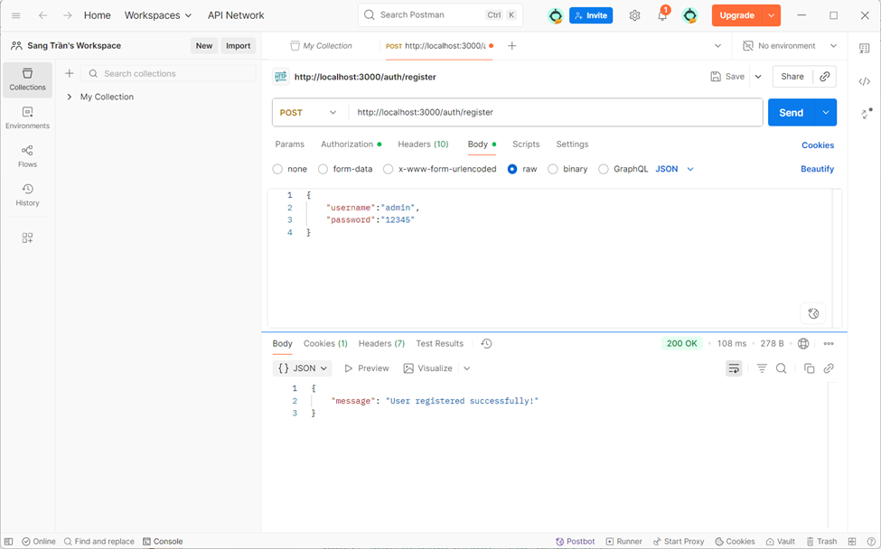
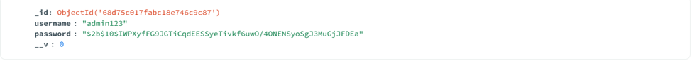
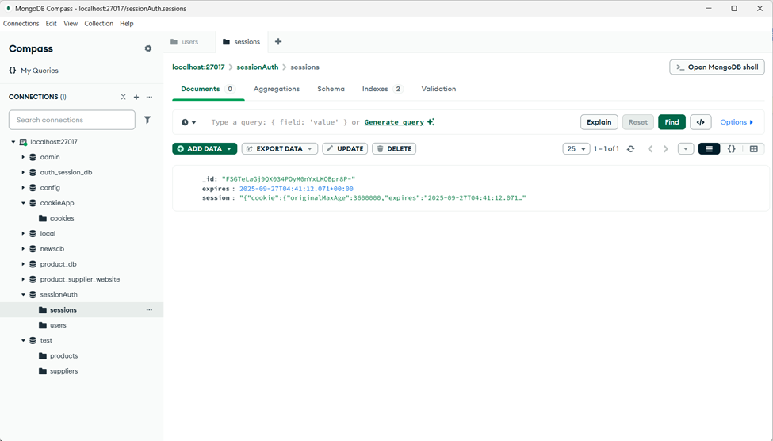
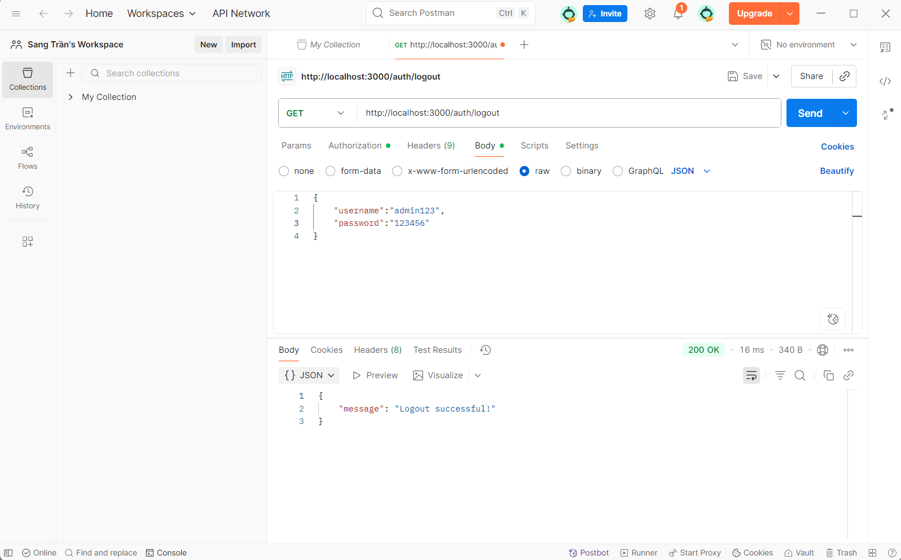
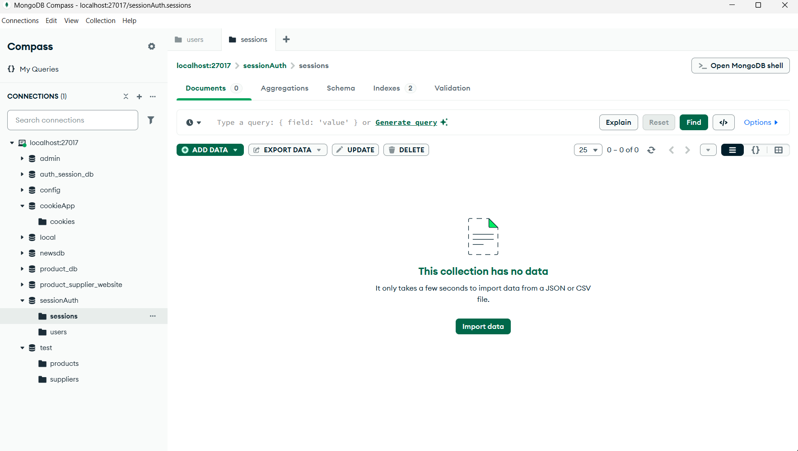

# Cookie Session Authentication Project

Dự án này minh họa việc triển khai xác thực người dùng sử dụng Cookie và Session trong Node.js với Express framework.

## Mô tả dự án

Cookie Session Authentication là một phương pháp xác thực phổ biến trong phát triển web, nơi thông tin phiên làm việc của người dùng được lưu trữ trên server và một cookie chứa session ID được gửi đến client.

## Kết quả Test API

### 1. Test đăng ký user (POST /auth/register)


**Mô tả**: 
- **Request**: POST `http://localhost:3000/auth/register`
- **Body**: JSON với `username: "admin"` và `password: "12345"`
- **Response**: Status 200 OK với message "User registered successfully!"
- **Chức năng**: API tạo tài khoản mới và lưu vào MongoDB với password được hash

### 2. Dữ liệu trong MongoDB


**Mô tả**: 
- **Sessions collection**: Chứa thông tin session với cookie ID, thời gian expires
- **Users collection**: Chứa thông tin user đã đăng ký
- **Database**: `sessionAuth` với các collection `sessions` và `users`
- **Chức năng**: Lưu trữ dữ liệu session và user information

### 3. Chi tiết user trong MongoDB  


**Mô tả**:
- **User ID**: ObjectId được tạo tự động
- **Username**: "admin123" 
- **Password**: Đã được hash bằng bcrypt để bảo mật
- **__v**: Version key của MongoDB
- **Chức năng**: Password được mã hóa an toàn trước khi lưu vào database

### 4. Test đăng nhập (POST /auth/login)


**Mô tả**:
- **Request**: POST `http://localhost:3000/auth/login` 
- **Body**: JSON với `username: "admin123"` và `password: "123456"`
- **Response**: Status 200 OK với message "Login successful!"
- **Chức năng**: Xác thực user và tạo session, trả về cookie để duy trì đăng nhập

### 5. Test đăng xuất (POST /auth/logout)


**Mô tả**:
- **Request**: POST `http://localhost:3000/auth/logout`
- **Headers**: Cookie session được gửi kèm từ request đăng nhập trước đó
- **Response**: Status 200 OK với message "Logout successful!"
- **Chức năng**: Hủy session của user hiện tại và xóa session khỏi MongoDB

### 6. Kiểm tra database sau khi đăng xuất


**Mô tả**:
- **Sessions collection**: Trống hoặc không còn session của user vừa đăng xuất
- **Chức năng**: Xác nhận rằng session đã được xóa hoàn toàn khỏi MongoDB
- **Bảo mật**: Đảm bảo không có session "ma" tồn tại trong hệ thống
- **Kết quả**: User cần đăng nhập lại để có thể truy cập các trang được bảo vệ

## API Endpoints

### Đăng ký user
- **URL**: `POST /auth/register`
- **Body**: 
```json
{
  "username": "admin", 
  "password": "12345"
}
```
- **Response**: `{"message": "User registered successfully!"}`

### Đăng nhập
- **URL**: `POST /auth/login`
- **Body**:
```json
{
  "username": "admin123",
  "password": "123456" 
}
```
- **Response**: `{"message": "Login successful!"}`

### Đăng xuất
- **URL**: `POST /auth/logout`
- **Headers**: Cookie session từ request đăng nhập
- **Response**: `{"message": "Logout successful!"}`
- **Chức năng**: Xóa session khỏi MongoDB và hủy cookie

## Tính năng chính

- ✅ API đăng ký user mới với password hash
- ✅ API đăng nhập và xác thực
- ✅ API đăng xuất và xóa session
- ✅ Tạo và quản lý session với MongoDB
- ✅ Sử dụng cookie để lưu trữ session ID
- ✅ Hash password bằng bcrypt cho bảo mật
- ✅ Lưu trữ user và session trong MongoDB
- ✅ Tự động xóa session khi đăng xuất

## Công nghệ sử dụng

- **Node.js**: Runtime JavaScript
- **Express.js**: Web framework 
- **MongoDB**: NoSQL database
- **express-session**: Quản lý session
- **connect-mongo**: Lưu session trong MongoDB
- **bcrypt**: Hash password
- **cookie-parser**: Xử lý cookie

## Cách chạy ứng dụng

```bash
# Cài đặt dependencies
npm install

# Chạy server
node app.js

# Truy cập ứng dụng
# http://localhost:3000
```

## Cấu trúc project

```
cookie_session_auth/
├── app.js              # File chính của ứng dụng
├── package.json        # Dependencies và scripts
├── README.md          # Tài liệu dự án
├── views/             # Template files (nếu có)
├── public/            # Static files (CSS, JS, images)
└── images/            # Screenshots test
    ├── image.png      # Test đăng ký user
    ├── image-1.png    # Chi tiết user trong MongoDB
    ├── image-2.png    # Sessions và users trong MongoDB
    ├── image-3.png    # Test đăng nhập
    ├── image-4.png    # Test đăng xuất
    └── image-5.png    # MongoDB sau khi xóa session
```

## Luồng hoạt động

1. **Đăng ký**: Client gửi POST `/auth/register` → Server hash password → Lưu user vào MongoDB → Trả về success message
2. **Đăng nhập**: Client gửi POST `/auth/login` → Server so sánh password hash → Tạo session trong MongoDB → Gửi cookie chứa session ID
3. **Xác thực**: Client gửi request kèm cookie → Server kiểm tra session trong MongoDB → Cho phép/từ chối truy cập
4. **Đăng xuất**: Client gửi POST `/auth/logout` → Server xóa session khỏi MongoDB → Hủy cookie → Trả về logout success

## Test với Postman

1. **Đăng ký user**:
   - Method: POST
   - URL: `http://localhost:3000/auth/register`
   - Headers: Content-Type: application/json
   - Body: `{"username": "admin", "password": "12345"}`

2. **Đăng nhập**:
   - Method: POST  
   - URL: `http://localhost:3000/auth/login`
   - Headers: Content-Type: application/json
   - Body: `{"username": "admin123", "password": "123456"}`

3. **Đăng xuất**:
   - Method: POST
   - URL: `http://localhost:3000/auth/logout`
   - Headers: Cookie session từ request đăng nhập
   - Body: Không cần
   
4. **Kiểm tra MongoDB**:
   - Mở MongoDB Compass
   - Kiểm tra collection `sessions` sau khi đăng xuất
   - Xác nhận session đã bị xóa hoàn toàn

## Bảo mật

- Session ID được tạo ngẫu nhiên và khó đoán
- Cookie có thể được cấu hình httpOnly và secure
- Session tự động hết hạn sau thời gian nhất định
- Dữ liệu nhạy cảm không được lưu trong cookie

